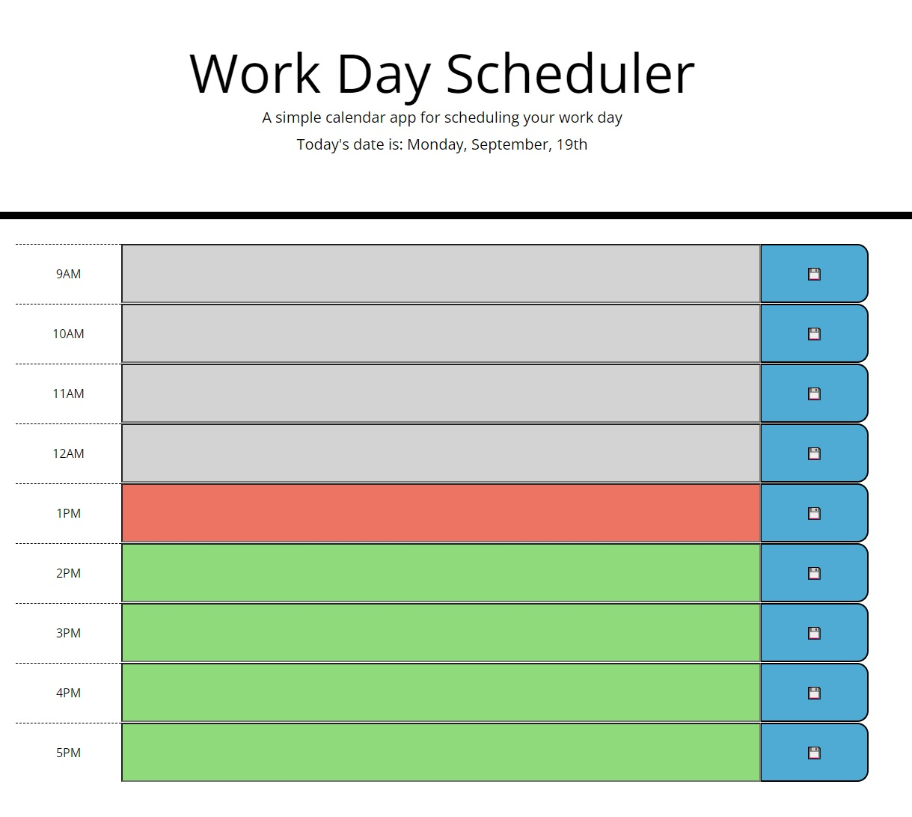
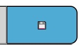

# Life Planner

## Description

The purpose of this application is to create a responsive, compact, and persistant planner. Users of this application can fill in the text areas of the planner relative to their goals/events for the day and expect to find those entries when they next return(assuming the entries were saved).

## Installation

N/A

## Usage

Attached to this Github and [linked here](https://aesthetic-justice.github.io/Life-Planner/) are portals to the application displayed in the image below.

Contained within the center column of each row is a textbox. To use the application correctly, fill the appropriate textbox corresponding to the intended timeslot and then click the blue save button to its immediate right. Displayed below.

Once saved, the event will be restored on return to the application.
Additionally, refreshing/loading the page will update the color of the timeslots to reflect the current time within common work-hours.

## Credits

All attached images were provided by the client and used with their permission.

## License

Please refer to the LICENSE file attached to this repo for further information.